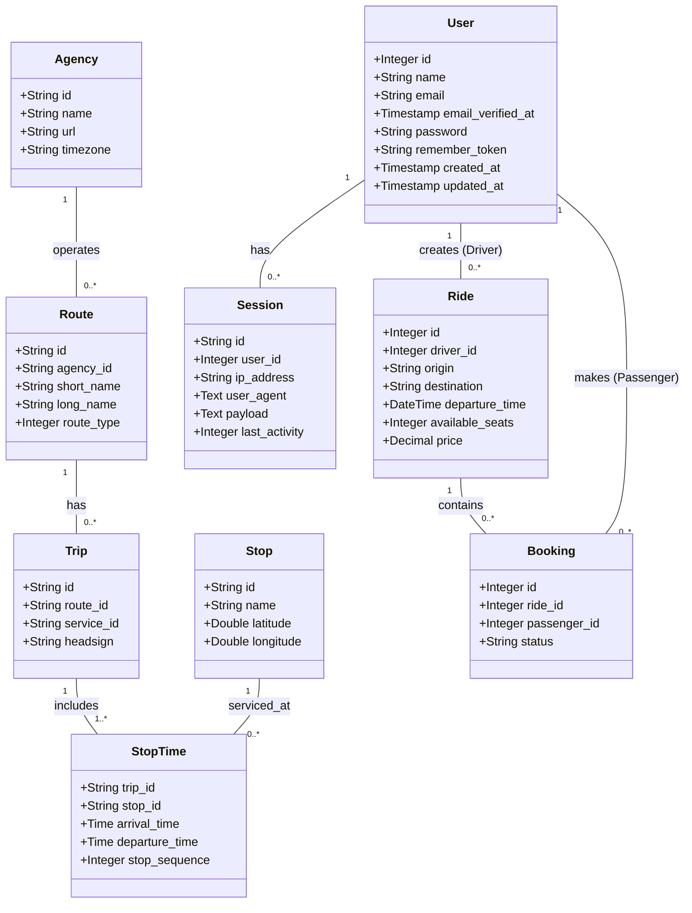

```mermaid
classDiagram
    class User {
        +Integer id
        +String name
        +String email
        +Timestamp email_verified_at
        +String password
        +String remember_token
        +Timestamp created_at
        +Timestamp updated_at
    }

    class Session {
        +String id
        +Integer user_id
        +String ip_address
        +Text user_agent
        +Text payload
        +Integer last_activity
    }

    %% Modelos de Transporte (Basados en GTFS)
    class Agency {
        +String id
        +String name
        +String url
        +String timezone
    }

    class Route {
        +String id
        +String agency_id
        +String short_name
        +String long_name
        +Integer route_type
    }

    class Trip {
        +String id
        +String route_id
        +String service_id
        +String headsign
    }

    class Stop {
        +String id
        +String name
        +Double latitude
        +Double longitude
    }

    class StopTime {
        +String trip_id
        +String stop_id
        +Time arrival_time
        +Time departure_time
        +Integer stop_sequence
    }

    %% Modelos de Carpooling
    class Ride {
        +Integer id
        +Integer driver_id
        +String origin
        +String destination
        +DateTime departure_time
        +Integer available_seats
        +Decimal price
    }

    class Booking {
        +Integer id
        +Integer ride_id
        +Integer passenger_id
        +String status
    }

    %% Relaciones
    User "1" -- "0..*" Session : has
    
    %% Relaciones Carpooling
    User "1" -- "0..*" Ride : creates (Driver)
    User "1" -- "0..*" Booking : makes (Passenger)
    Ride "1" -- "0..*" Booking : contains

    %% Relaciones GTFS
    Agency "1" -- "0..*" Route : operates
    Route "1" -- "0..*" Trip : has
    Trip "1" -- "1..*" StopTime : includes
    Stop "1" -- "0..*" StopTime : serviced_at
```